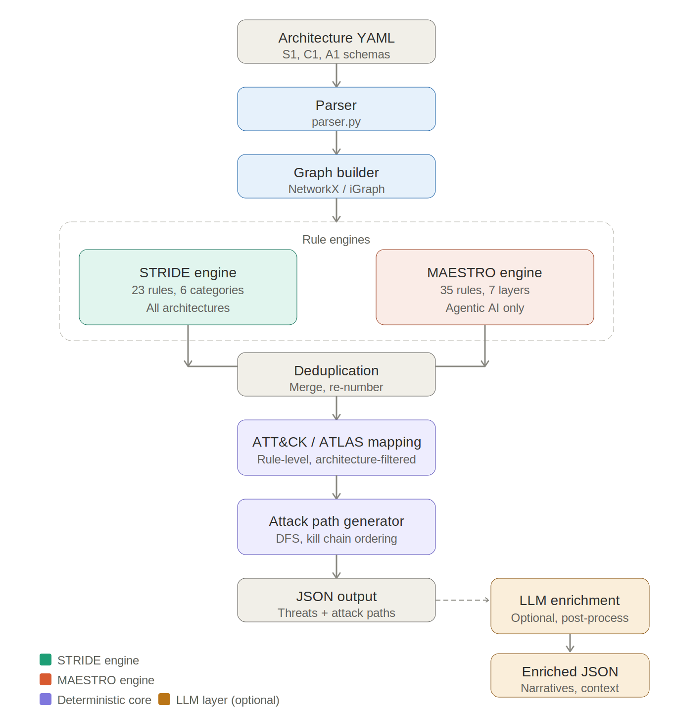
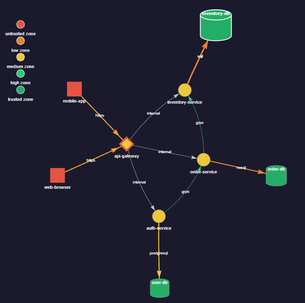
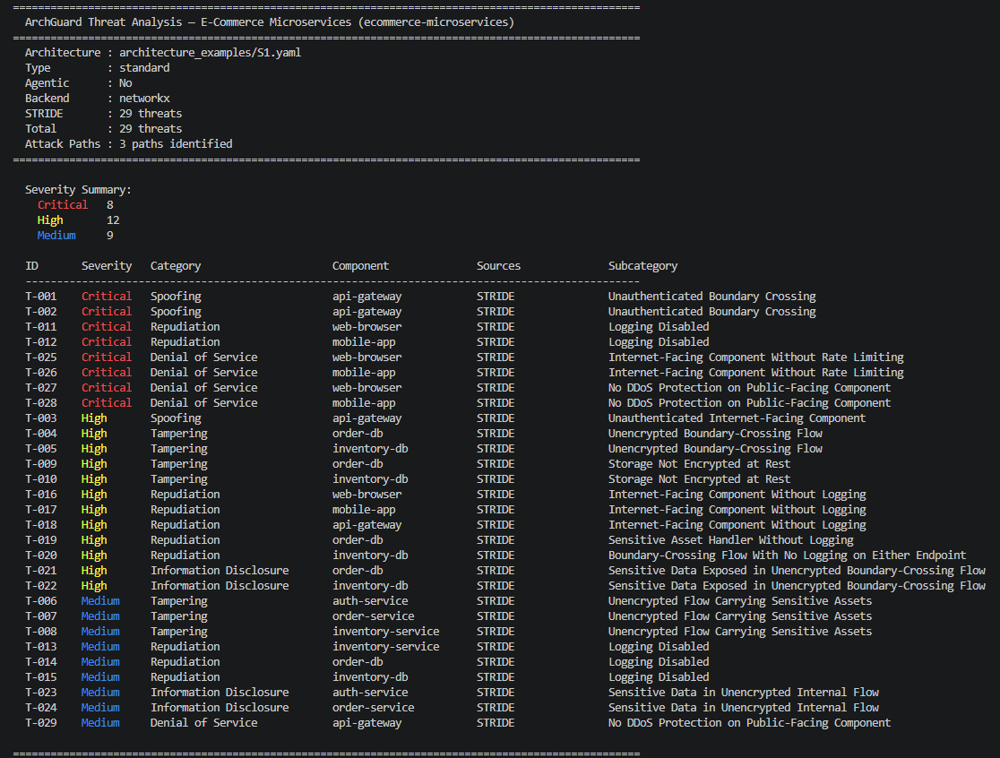
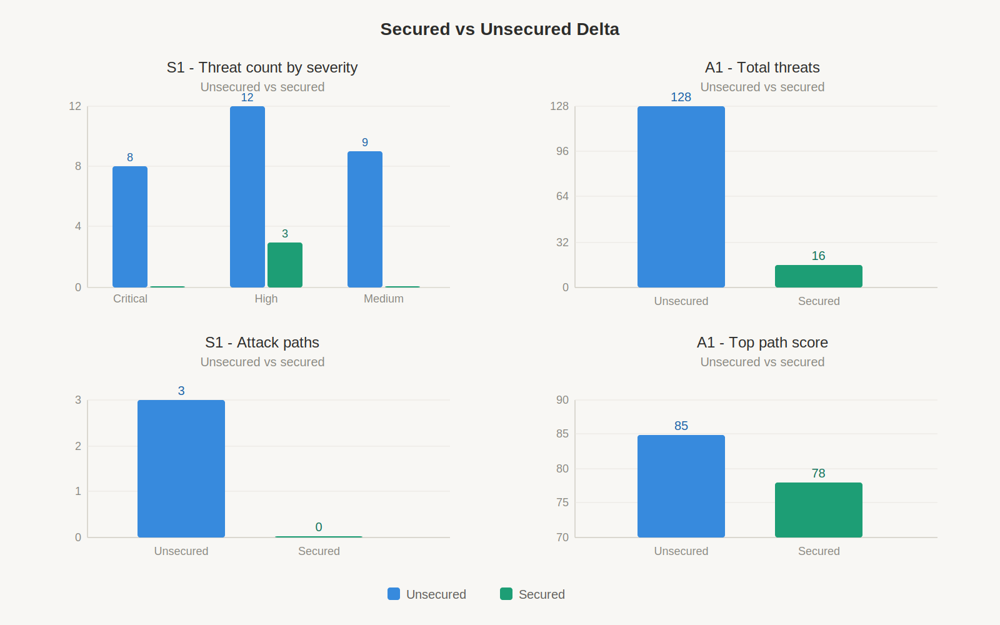
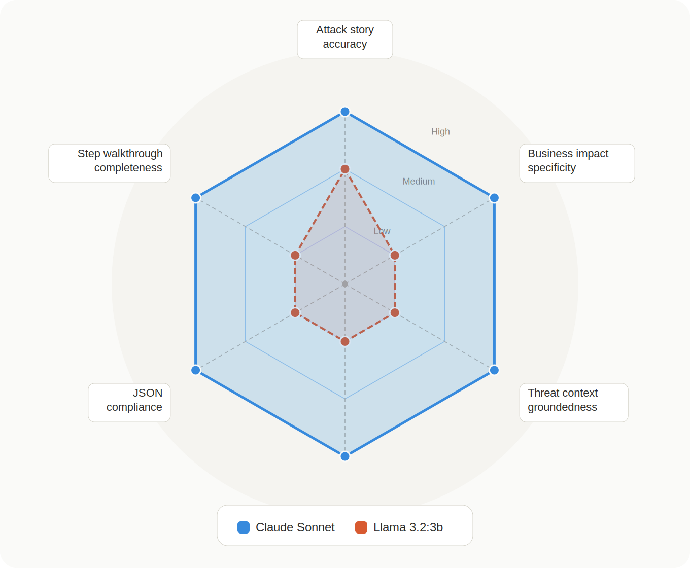

# ArchGuard
### Design-Time Threat Modeling Engine and Attack Path Analysis for Software, Cloud, and Agentic AI Architectures with LLM-Augmented Enrichment


[](https://www.python.org/)
[]()

---

## Overview

ArchGuard is a hybrid threat modeling engine that combines a deterministic STRIDE-based threat identification core with MITRE ATT&CK and MITRE ATLAS technique mapping, graph-based attack path generation, and an optional LLM-augmented enrichment layer to support design-time security analysis of modern software, cloud, and agentic AI architectures.
 
The system accepts structured architecture descriptions in YAML format and produces component-level threat models, mapped attacker techniques, realistic multi-step attack paths, and accessible plain-English explanations - making security analysis scalable, explainable, and framework-grounded.
 
> This project is developed as part of an independent study (CSCI-Y 790) at Indiana University, Spring 2026.

---

## Motivation

Existing threat modeling tools like Microsoft Threat Modeling Tool and OWASP Threat Dragon rely heavily on manual analysis and lack scalability. Attacker-centric frameworks like MITRE ATT&CK are typically applied post-deployment rather than at design time. ArchGuard bridges this gap by integrating both perspectives into a single, automated, design-time workflow that covers traditional software and cloud architectures as well as the emerging agentic AI attack surface modeled by MITRE ATLAS.

---

## Architecture Types Supported

| Type | Examples | Threat Focus |
|---|---|---|
| Software / Service-Based | Microservices, REST APIs, frontend-API-database | Auth flaws, injection, privilege escalation |
| Cloud-Native | AWS/GCP components, IAM, RDS, ALB | Misconfigurations, excessive privileges, data exfiltration |
| Agentic AI | ReAct single-agent, hierarchical multi-agent | Prompt injection, tool misuse, unsafe execution |

---

## System Pipeline


---
 
## Project Structure
 
```
ArchGuard/
├── architecture_examples/        # Sample architecture YAMLs
│   ├── S1.yaml                   # E-Commerce microservices
│   ├── S1_secured.yaml           # S1 with all controls applied
│   ├── C1.yaml                   # Cloud AWS architecture
│   ├── A1.yaml                   # ReAct agentic AI (unsecured)
│   └── A1_secured.yaml           # ReAct agentic AI (secured)
├── graph/                        # Graph representation layer
│   ├── base.py                   # Backend interface
│   ├── builder.py                # Graph construction
│   ├── networkx.py               # NetworkX backend
│   ├── igraph.py                 # iGraph backend
│   └── visualizer.py             # Interactive HTML visualization
├── Threat_Engine/
│   ├── STRIDE/                   # 6 STRIDE rule modules
│   │   ├── Spoofing.py
│   │   ├── Tampering.py
│   │   ├── Repudiation.py
│   │   ├── Information_disclosure.py
│   │   ├── Denial_of_service.py
│   │   └── Elevation_of_privilege.py
│   ├── MAESTRO/                  # 7 MAESTRO layer modules
│   │   ├── L1_Foundation.py
│   │   ├── L2_Data.py
│   │   ├── L3_Agent.py
│   │   ├── L4_Deployment_Infra.py
│   │   ├── L5_Eval_Obsv.py
│   │   ├── L6_Security_Compliance.py
│   │   └── L7_Agent_Ecosystem.py
│   ├── Mapping/                  # ATT&CK / ATLAS mapping
│   │   ├── mapper.py
│   │   └── techniques.py
│   ├── Attack_Path/              # Attack path generation
│   │   ├── finder.py
│   │   ├── Scorer.py
│   │   └── Tactic_order.py
│   ├── llm/                      # LLM enrichment layer
│   │   ├── prompts.py
│   │   ├── enrichment.py         # Claude Sonnet (Anthropic API)
│   │   └── enrichment_ollama.py  # Local model (Ollama)
│   └── model.py                  # Threat dataclass
├── engine.py                     # Main pipeline orchestrator
├── parser.py                     # YAML parser and validator
├── llm_enrichment.py             # LLM enrichment CLI
├── .env                          # API key (not committed)
└── requirements.txt
```
---
 
## Architecture Schema
 
### Key Attributes
 
#### Project
| Field | Description |
|---|---|
| `id` | Unique identifier for the architecture |
| `name` | Display name |
| `architecture_type` | `software`, `cloud`, `event-driven`, or `agentic-ai` |
 
#### Trust Zones
| Field | Description |
|---|---|
| `id` | Referenced by components |
| `trust_level` | `untrusted`, `low`, `medium`, or `trusted` |
 
#### Components
| Field | Description |
|---|---|
| `id` | Referenced by data flows |
| `type` | Drives which STRIDE and MAESTRO rules apply |
| `trust_zone` | Which zone this component belongs to |
| `internet_facing` | Reachable from the internet |
| `logging` | `false` triggers Repudiation threat |
| `encrypted_at_rest` | `false` triggers Information Disclosure threat |
| `rate_limiting` | `false` triggers Denial of Service threat |
 
#### Assets
| Field | Description |
|---|---|
| `id` | Referenced by data flows |
| `sensitivity` | `low`, `medium`, `high`, or `critical` - drives threat severity |
 
#### Data Flows
| Field | Description |
|---|---|
| `source` / `destination` | Direction of data movement |
| `crosses_boundary` | Crosses trust zones - high-risk trigger |
| `encrypted_in_transit` | `false` triggers Tampering and Information Disclosure |
| `authenticated` | `false` triggers Spoofing threat |
| `assets` | What sensitive data travels through this flow |
 
---

## Usage
 
All commands are run from the root `ArchGuard/` directory with the virtual environment activated.
 
### Step 1 - Validate an architecture file
```bash
python parser.py architecture_examples/S1.yaml
```
 
**Expected output:**
```
Parsed successfully: E-Commerce Microservices
   Trust zones : 3
   Components  : 9
   Assets      : 5
   Data flows  : 10
```
 
---
 
### Step 2 - Build and inspect the graph
```bash
python -m graph.builder architecture_examples/S1.yaml networkx
```
 
- Backend options: `networkx` (default) or `igraph`
---
 
### Step 3 - Generate interactive visualization
 
```bash
python -m graph.visualizer architecture_examples/S1.yaml networkx S1_graph.html
```
 
Opens as an interactive HTML file in any browser. Supports drag, zoom, and hover tooltips showing security properties for each node and edge.



### Step 4 - Run the full threat analysis engine
 
```bash
# Table output (terminal)
python engine.py architecture_examples/S1.yaml
 
# JSON output saved to file
python engine.py architecture_examples/S1.yaml --format json --output S1_results.json
 
# Use iGraph backend
python engine.py architecture_examples/A1.yaml --format json --output A1_results.json --backend igraph
```
 
**Expected terminal output:**



 
---
 
### Step 5 - Run LLM enrichment (optional)
 
Requires an Anthropic API key set in `.env`:
```
ANTHROPIC_API_KEY=your-key-here
```
 
```bash
# Enrich with Claude Sonnet (default)
python llm_enrichment.py S1_results.json --output S1_enriched.json
 
# Enrich with local Llama model via Ollama
python llm_enrichment.py S1_results.json --ollama --model llama3.2:3b --output S1_ollama_enriched.json
 
# Paths only (faster, fewer API calls)
python llm_enrichment.py S1_results.json --paths-only --output S1_enriched.json
```
 
---
 
## Sample Output
 
### Threat entry (JSON)
 
```json
{
  "id": "T-001",
  "component": "api-gateway",
  "category": "Spoofing",
  "subcategory": "Unauthenticated Boundary Crossing",
  "severity": "Critical",
  "sources": ["STRIDE"],
  "attack_techniques": ["T1078", "T1190"],
  "attack_mapping": [
    {
      "tactics": ["Initial Access", "Defense Evasion", "Persistence", "Privilege Escalation"],
      "technique_id": "T1078",
      "technique_name": "Valid Accounts",
      "framework": "ATTACK",
      "url": "https://attack.mitre.org/techniques/T1078/"
    }
  ],
  "threat_context": "The api-gateway is exposed to the internet without enforcing authentication on incoming requests, meaning any caller can interact with it as if they were a legitimate client..."
}
```
 
### Attack path entry (JSON)
 
```json
{
      "id": "AP-001",
      "name": "Initial Access via web-browser -> Impact on user-db",
      "severity": "Critical",
      "score": 63,
      "rank": 1,
      "entry_point": "web-browser",
      "target": "user-db",
      "components_traversed": [
        "web-browser",
        "api-gateway",
        "auth-service",
        "user-db"
      ],
      "step_count": 4,
      "threat_ids": [
        "T-011",
        "T-001",
        "T-006"
      ],
      "steps": [
        {
          "step": 1,
          "component": "web-browser",
          "component_type": "web-application",
          "tactic": "Initial Access",
          "technique_id": "T1078",
          "technique_name": "Valid Accounts",
          "framework": "ATTACK",
          "threat_id": "T-011",
          "threat_subcategory": "Logging Disabled",
          "threat_severity": "Critical"
        },
        {
          "step": 2,
          "component": "api-gateway",
          "component_type": "api-gateway",
          "tactic": "Initial Access",
          "technique_id": "T1078",
          "technique_name": "Valid Accounts",
          "framework": "ATTACK",
          "threat_id": "T-001",
          "threat_subcategory": "Unauthenticated Boundary Crossing",
          "threat_severity": "Critical"
        },
        {
          "step": 3,
          "component": "auth-service",
          "component_type": "microservice",
          "tactic": "Execution",
          "technique_id": "T1059",
          "technique_name": "Command and Scripting Interpreter",
          "framework": "ATTACK",
          "threat_id": "T-006",
          "threat_subcategory": "Unencrypted Flow Carrying Sensitive Assets",
          "threat_severity": "Medium"
        },
        {
          "step": 4,
          "component": "user-db",
          "component_type": "database",
          "tactic": "Impact",
          "technique_id": "",
          "technique_name": "Target Reached",
          "framework": "",
          "threat_id": "",
          "threat_subcategory": "High-value target accessed",
          "threat_severity": "High"
        }
      ],
      "attack_story": "This critical-severity attack path begins at the web browser, where an attacker leverages valid or stolen credentials to initiate access while the absence of logging means every move goes completely undetected from the start. The attacker then reaches the API gateway, which fails to enforce authentication at its boundary, allowing lateral movement deeper into the architecture without any challenge or verification....",
      "step_walkthrough": [
        {
          "step": 1,
          "threat_explanation": "Using valid credentials - whether stolen, purchased, or obtained through phishing - the attacker initiates a session from the web browser. The critical weakness here is that logging is disabled, meaning there is no audit trail of this access...."
        },
        {
          "step": 2,
          "threat_explanation": "The attacker's request reaches the API gateway, which is supposed to act as a controlled entry point into internal services. However, the gateway allows unauthenticated boundary crossing - it does not enforce a secondary authentication or authorization check before routing traffic to internal components...."
        },
        {
          "step": 3,
          "threat_explanation": "Now inside the perimeter, the attacker reaches the auth-service. The communication flow to and from this service is unencrypted despite carrying sensitive assets such as credentials, tokens, or session data...."
        },
        {
          "step": 4,
          "threat_explanation": "The attacker reaches the user-db with the access and credentials harvested in the previous steps. At this stage they can exfiltrate the full contents of the user database including usernames, hashed or plaintext passwords, email addresses, personal identifiable information (PII), and any linked profile or behavioral data...."
        }
      ],
      "business_impact": "A breach of the user database through this undetected path constitutes a reportable data incident under GDPR Article 33, CCPA, and PCI DSS Requirement 12.10, exposing the organization to mandatory breach notifications, regulatory fines potentially reaching tens of millions of dollars, and the lasting reputational damage of publicly disclosing that customer personal data was silently compromised from end to end."
    }
```
---
### Secured vs Unsecured Delta charts showing threat reduction across S1 and A1 architectures


---
### Radar chart comparing Claude Sonnet vs Llama 3.2:3b enrichment quality across six dimensions


---
 
## Evaluation Summary
 
| Criterion | Finding |
|---|---|
| Manual baseline comparison | 3.4% false positive rate. Engine missed all 5 Elevation of Privilege threats |
| Secured vs unsecured delta | 90% threat reduction on S1, 87.5% on A1 when controls applied |
| Attack path realism | All paths follow real data flow edges. T1059 at auth-service is a known partial mismatch |
| Determinism | Byte-for-byte identical output across repeated runs |
| LLM comparison | Claude Sonnet: 0% parse failure. Llama 3.2:3b: 30% parse failure, lower groundedness |
 
---
 
## Known Limitations
 
- Elevation of Privilege rules rely on explicit `over_privileged: true` flag rather than detecting structural authorization conditions from the graph
- Technique-component context matching is not enforced - some techniques may be assigned to components where they are not contextually appropriate
- Target detection in attack path generation relies on explicit `stores_pii` and `stores_credentials` schema properties
- Hybrid architectures spanning multiple paradigms in a single system are not yet supported
- LLM enrichment quality is model-dependent - local models produce lower groundedness than frontier models
---

## References
 
- [MITRE ATT&CK](https://attack.mitre.org/matrices/enterprise/)
- [MITRE ATLAS](https://atlas.mitre.org/matrices/ATLAS)
- [OWASP Threat Dragon](https://owasp.org/www-project-threat-dragon/)
- [Microsoft Threat Modeling Tool](https://learn.microsoft.com/en-us/azure/security/develop/threat-modeling-tool)
- [Anthropic Claude API](https://docs.anthropic.com)
- [Ollama](https://ollama.com)